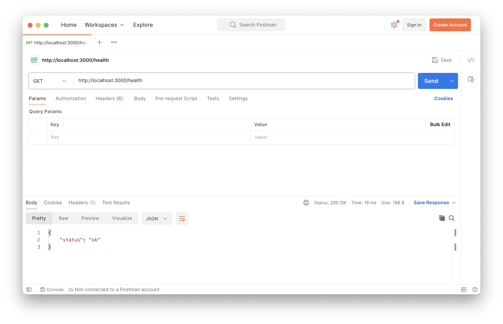
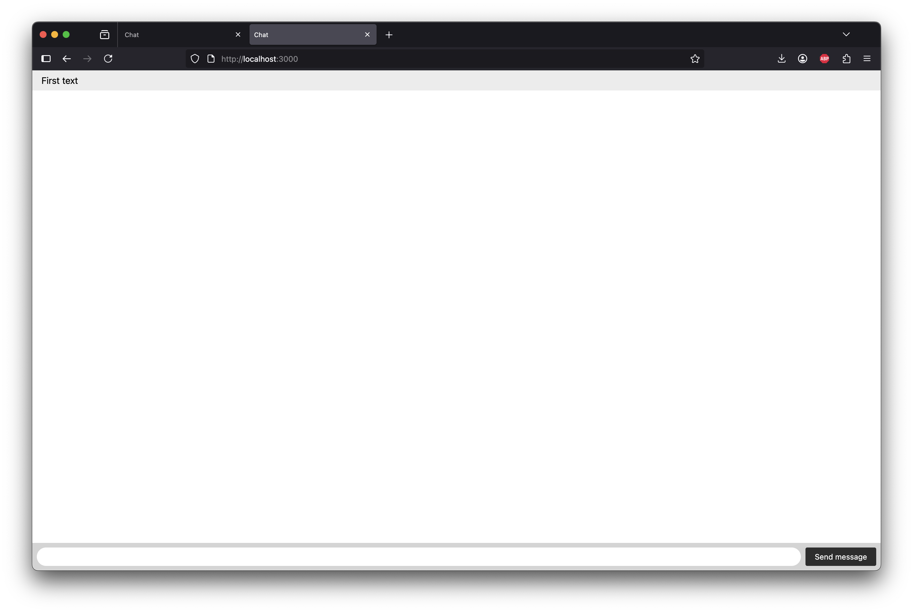
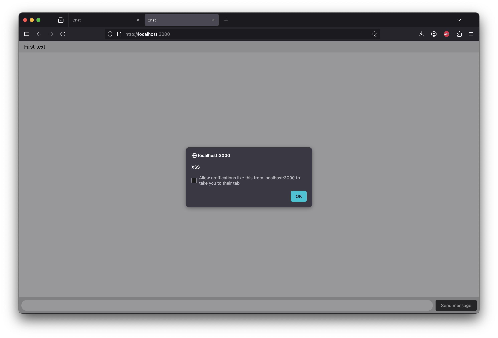

## XSS уязвимости и способы защиты от них
### Цель работы
Познакомиться с XSS уязвимостями и способами защиты от них
### Технические требования:
- Наличие [Docker](https://docs.docker.com/desktop/) и [Docker Compose](https://docs.docker.com/compose/install/)
- Наличие [cURL](https://curl.se/download.html) / [Postman](https://www.postman.com/downloads/) / [Insomnia](https://insomnia.rest/download)

### Ход работы:
Данная практическая работа является прямым продолжением практической работы №5, поэтому наличие кода, связанного с e2e шифрованием будет приветствоваться.

1. Запустите приложение при помощи команды
`docker compose up -d --build`
2. Убедитесь, что приложение запущено корректно при помощи следующего cURL запроса
```cURL
curl --location 'http://localhost:3000/health'
```

В случае успешного запуска при выполнении cURL запроса отображается следующий текст


3. Откройте две вкладки в браузере со [следующим](http://localhost:3000) URL адресом
4. Введите произвольный текст сообщения в первой вкладке и отправьте его
5. Удостоверьтесь, что аналогичный текст представлен во второй вкладке


6. Введите следующий код в поле ввода
```

```
7. Убедитесь, что другой вкладке отобразилось сообщение с надписью XSS


8. Модифицируйте исходный код `public/index.html` для устранения XSS уязвимости. Добавьте CSP политики.

### Документация:

[OWASP](https://cheatsheetseries.owasp.org/cheatsheets/Cross_Site_Scripting_Prevention_Cheat_Sheet.html)

[DOMPurify](https://github.com/cure53/DOMPurify)

### Контрольные вопросы:
1. Что такое XSS уязвимость?
2. Какие способы защиты от XSS уязвимостей вы знаете? В чем их достоинства и недостатки
3. Что такое CSP? Как происходит настройка CSP?

